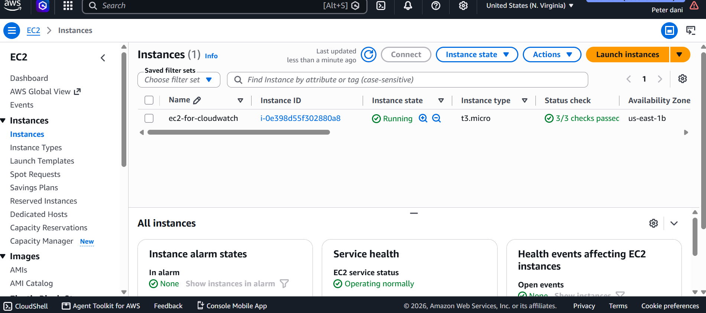
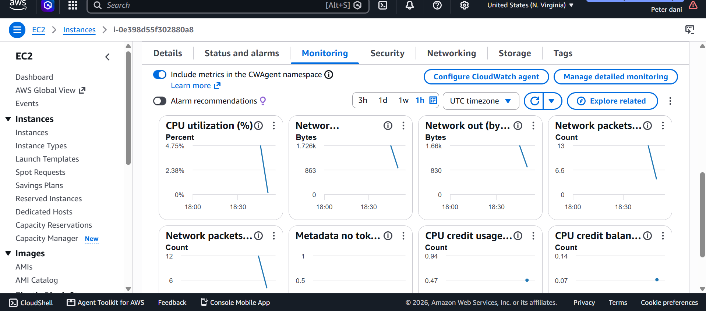
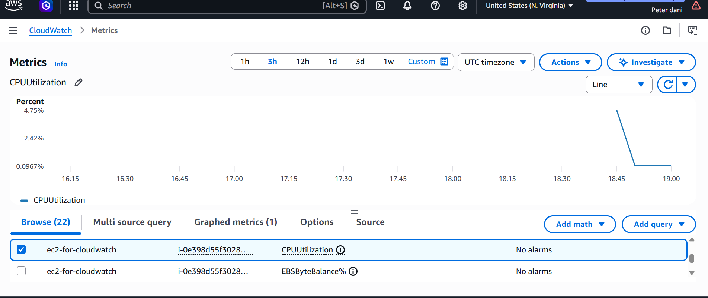
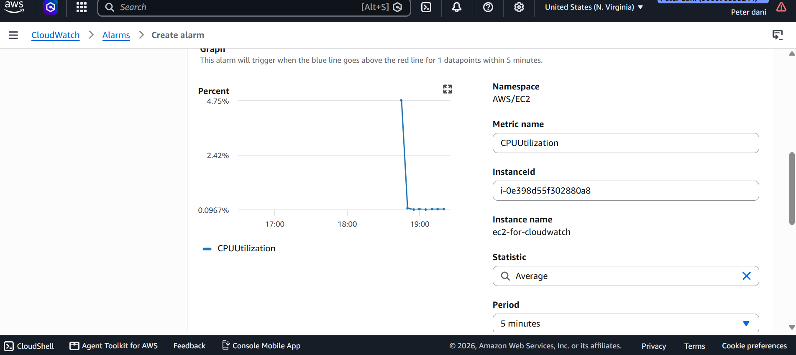
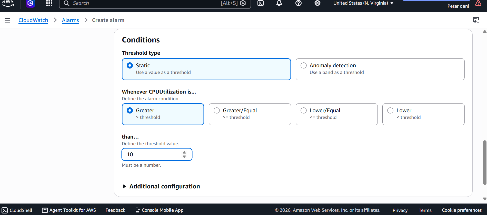
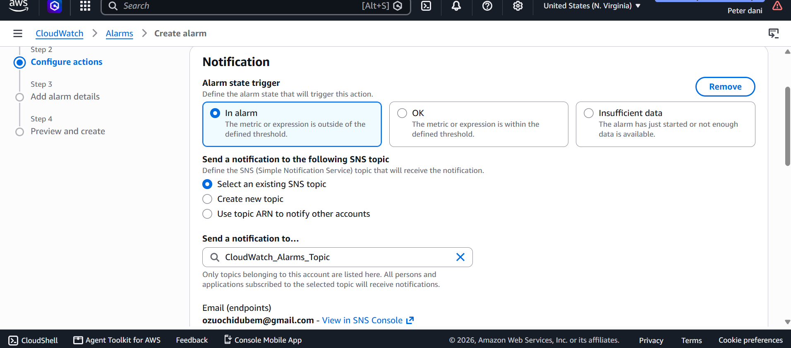
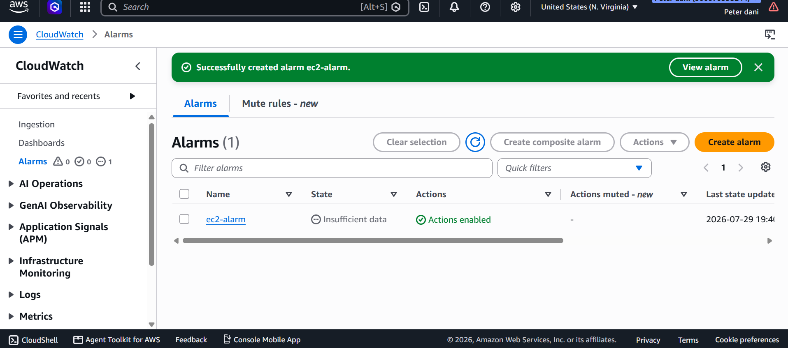

# AWS CloudWatch Monitoring & SNS Alarm

## Project Overview

This project demonstrates how to monitor an Amazon EC2 instance using AWS CloudWatch. It includes collecting CloudWatch metrics, creating alarms based on CPU utilization, configuring Amazon SNS notifications, and validating that monitoring is working correctly.

---

## Services Used

- Amazon EC2
- Amazon CloudWatch
- Amazon SNS

---

## Objectives

- Launch an EC2 instance
- Monitor EC2 performance metrics
- View CloudWatch metrics
- Create a CloudWatch Alarm
- Configure Amazon SNS notifications
- Validate alarm creation

---

## Project Workflow

EC2 Instance
      │
      ▼
CloudWatch Metrics
      │
      ▼
CloudWatch Alarm
      │
      ▼
Amazon SNS
      │
      ▼
Email Notification

---

## Screenshots

### 1. EC2 Instance Running

Verified the EC2 instance is running before monitoring.

---

### 2. EC2 Monitoring Page

Viewed EC2 monitoring graphs generated by CloudWatch.

---

### 3. CloudWatch Metrics

Verified CloudWatch metrics for the EC2 instance.

---

### 4. Alarm Configuration

Configured the CloudWatch alarm threshold.

---

### 5. Alarm Notification Settings

Configured additional alarm settings and notification actions.

---

### 6. Amazon SNS Topic

Created an SNS topic for alarm notifications.

---

### 7. Alarm Created Successfully

Verified that the CloudWatch alarm was successfully created.

---

## Key Concepts Learned

- Amazon CloudWatch
- CloudWatch Metrics
- CloudWatch Alarms
- Amazon SNS
- EC2 Monitoring
- Performance Monitoring
- Threshold-Based Alerting
- Infrastructure Monitoring

---

## Skills Demonstrated

- AWS Monitoring
- Performance Analysis
- Infrastructure Monitoring
- CloudWatch Alarm Configuration
- SNS Notification Setup
- EC2 Performance Monitoring

---

## Outcome

Successfully implemented AWS CloudWatch monitoring by collecting EC2 metrics, configuring CloudWatch alarms, integrating Amazon SNS for notifications, and validating the monitoring workflow for proactive infrastructure management.
